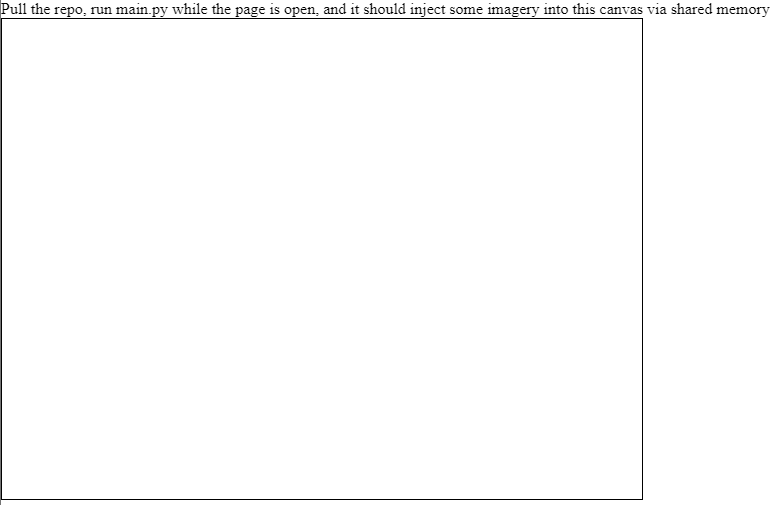

# [PyWebMem](https://zalo.github.io/PyWebMem/)

  
  
    <!-- No idea what license this should be! -->

Proof of Concept for a high-speed shared memory communication protocol with the browser.

The Python script `main.py` will scan for instances of `chrome.exe`, and search for the magic ints `0123456789` and `987654321` to demarcate a shared memory zone.   It will then write directly into the memory of the Javascript interpreter, which will copy that data into a canvas for display.

It is currently very brittle!  (But this can be improved over time)

 # Dependencies
 - [mem_edit](https://pypi.org/project/mem-edit/) (GPLv3 Python Memory Scanner)
